# 🌐 Multi-Site Enterprise WAN using Multi-Area OSPF

## 📖 Project Overview

This project simulates a real-world enterprise network consisting of a Headquarters (HQ) in Chennai and two branch offices in Mumbai and Delhi.

The network demonstrates enterprise networking concepts including VLAN segmentation, Router-on-a-Stick (ROAS), centralized DHCP with DHCP Relay, Multi-Area OSPF routing, OSPF MD5 authentication, and WAN redundancy through link failure simulation.

The objective is to build a scalable, secure, and fault-tolerant enterprise WAN that automatically adapts to network failures while maintaining communication between all sites.

---

# 🏢 Enterprise Scenario

A company has three office locations.

🏢 Headquarters – Chennai

🏢 Branch Office – Mumbai

🏢 Branch Office – Delhi

Each office contains multiple departments connected through VLANs.

The Headquarters router acts as the centralized DHCP Server.

Dynamic routing is implemented using Multi-Area OSPF.

If one WAN link fails, OSPF automatically reroutes traffic using the alternate path.

---

# 🗺️ Network Topology

> Replace this image with your topology screenshot.

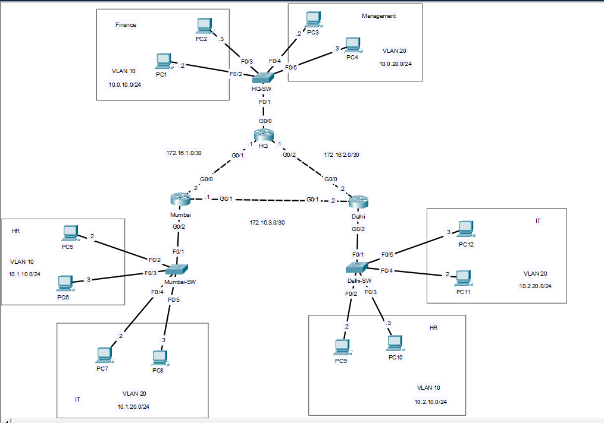

---

# 🖥️ IP Addressing

## Headquarters

| Department | VLAN    | Network      |
|------------|---------|--------------|
| Finance    | VLAN 10 | 10.0.10.0/24 |
| Management | VLAN 20 | 10.0.20.0/24 |

---

## Mumbai

| Department | VLAN    | Network      |
|------------|---------|--------------|
| HR         | VLAN 10 | 10.1.10.0/24 |
| IT         | VLAN 20 | 10.1.20.0/24 |

---

## Delhi

| Department | VLAN    | Network      |
|------------|---------|--------------|
| HR         | VLAN 10 | 10.2.10.0/24 |
| IT         | VLAN 20 | 10.2.20.0/24 |

---

# 🌍 WAN Links

| Connection     | Network       |
|----------------|---------------|
| HQ ↔ Mumbai    | 172.16.1.0/30 |
| HQ ↔ Delhi     | 172.16.2.0/30 |
| Mumbai ↔ Delhi | 172.16.3.0/30 |

---

# 🛠 Technologies Used

- Cisco Packet Tracer
- Cisco IOS
- VLAN
- 802.1Q Trunking
- Router-on-a-Stick (ROAS)
- DHCP Server
- DHCP Relay
- OSPF
- Multi-Area OSPF
- OSPF MD5 Authentication

---

# ⚙️ Features Implemented

✅ VLAN Configuration

✅ Trunking

✅ Router-on-a-Stick

✅ Centralized DHCP Server

✅ DHCP Relay (IP Helper Address)

✅ Dynamic Routing using OSPF

✅ Multi-Area OSPF

✅ OSPF MD5 Authentication

✅ WAN Link Redundancy

✅ Link Failure Simulation

---

# 📸 Configuration Screenshots

## 1️⃣ Network Topology


---

## 2️⃣ VLAN Configuration


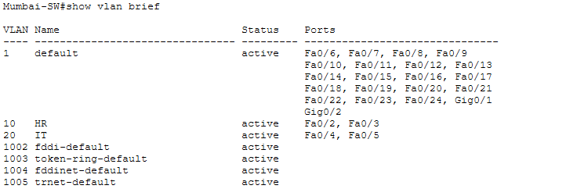


---

## 3️⃣ Trunk Configuration

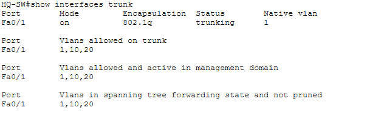


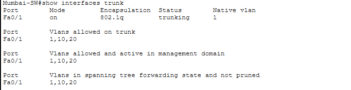


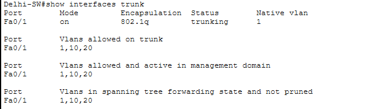

---

## 4️⃣ Router-on-a-Stick


### HQ Router — Area 0 (Backbone)

```bash
interface GigabitEthernet0/0
 no shutdown

interface GigabitEthernet0/0.10
 encapsulation dot1Q 10
 ip address 10.0.10.1 255.255.255.0
 ip helper-address 10.0.10.1
 no shutdown

interface GigabitEthernet0/0.20
 encapsulation dot1Q 20
 ip address 10.0.20.1 255.255.255.0
 no shutdown
```

## Mumbai Router - ROAS Sub-interfaces

```bash
interface GigabitEthernet0/2
 no shutdown

interface GigabitEthernet0/2.10
 encapsulation dot1Q 10
 ip address 10.2.10.1 255.255.255.0
 ip helper-address 10.0.10.1
 no shutdown

interface GigabitEthernet0/2.20
 encapsulation dot1Q 20
 ip address 10.2.20.1 255.255.255.0
 ip helper-address 10.0.20.1
 no shutdown
```

## Delhi Router - ROAS Subinterfaces

```bash
interface GigabitEthernet0/2
 no shutdown

interface GigabitEthernet0/2.10
 encapsulation dot1Q 10
 ip address 10.3.10.1 255.255.255.0
 ip helper-address 10.0.10.1
 no shutdown

interface GigabitEthernet0/2.20
 encapsulation dot1Q 20
 ip address 10.3.20.1 255.255.255.0
 ip helper-address 10.0.20.1
 no shutdown
```

## 5️⃣ DHCP Configuration

---

## 6️⃣ DHCP Relay

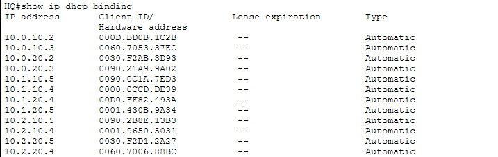

---

## 7️⃣ OSPF Neighbors

Command

```bash
show ip ospf neighbor
```

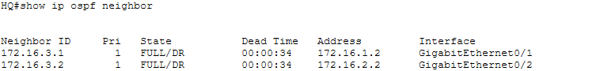


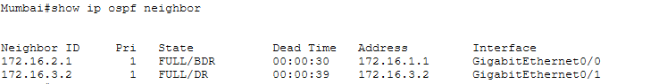


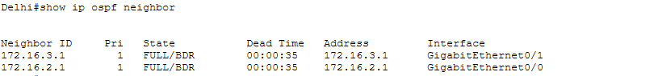

---

## 8️⃣ Routing Table

Command

show ip route

Routing table of HQ router


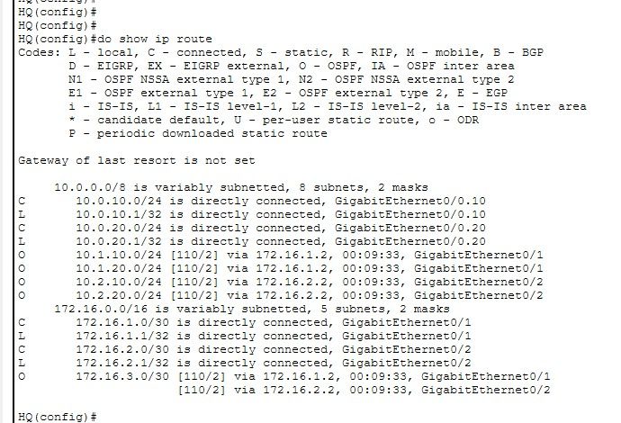


Routing table of Delhi router 


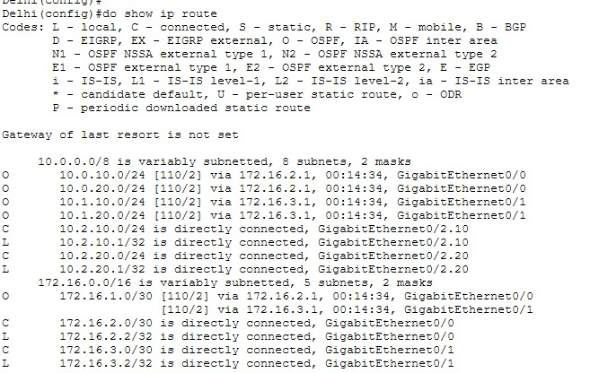


Routing table of HQ router (after ospf multi-area)


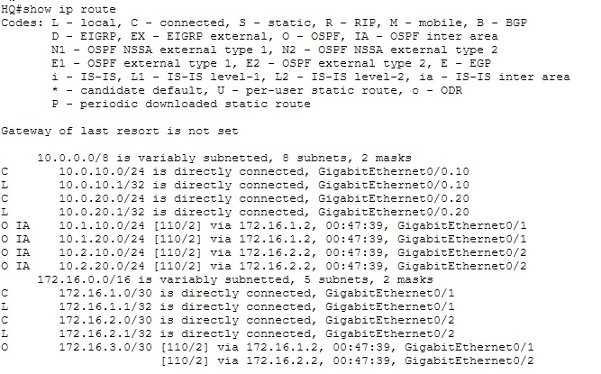


---

## 9️⃣ Multi-Area OSPF

Area Allocation

| Area   | Networks                  |
|--------|---------------------------|
| Area 0 | Backbone (HQ + WAN Links) |
| Area 1 | Mumbai LAN                |
| Area 2 | Delhi LAN                 |

---

## 🔐 OSPF MD5 Authentication

Example

```cisco
interface GigabitEthernet0/1

ip ospf authentication message-digest

ip ospf message-digest-key 1 md5 Cisco123
```

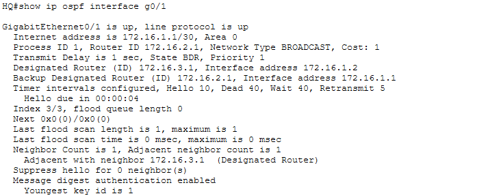

---

## 🔄 Link Failure Simulation

A WAN link between HQ and Mumbai was manually shut down.

Traffic automatically rerouted through Delhi.

After restoring the interface, OSPF converged back to the optimal path.

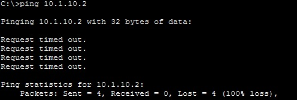

---

# ✅ Verification 

Ping was sent from mumbai to HQ


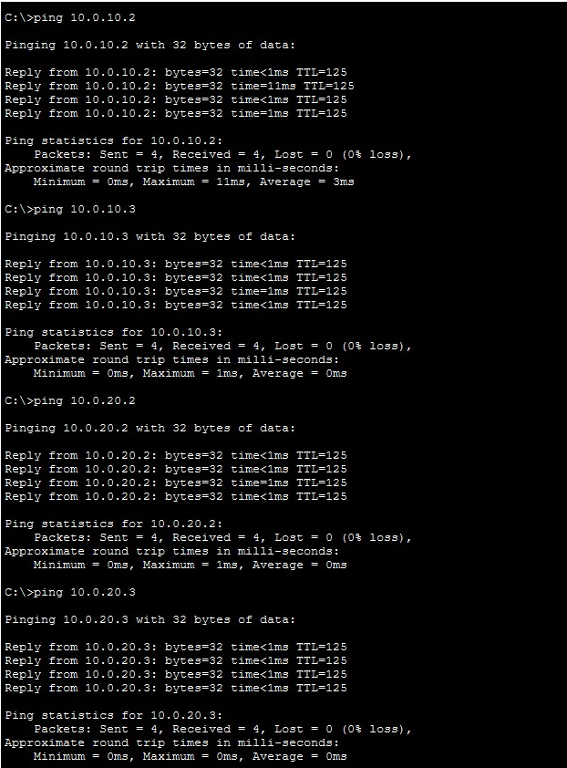


Ping was sent from HQ to Mumbai


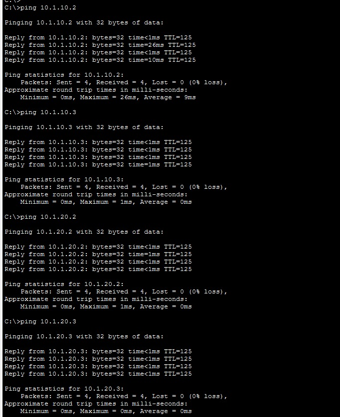


Ping was sent from Mumbai to Delhi


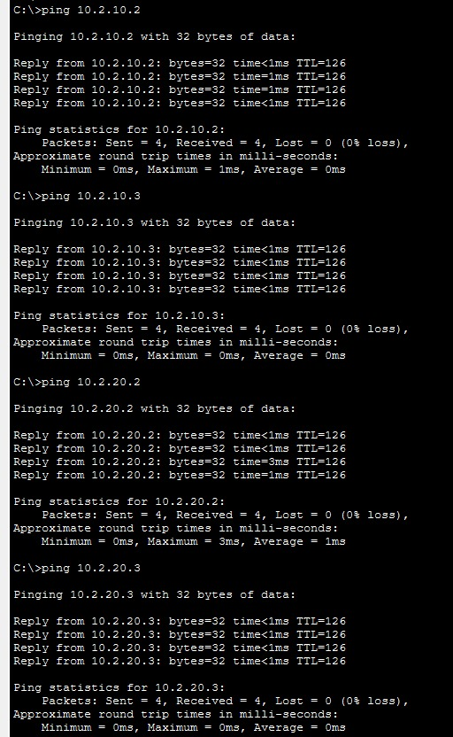


---

# 📚 Skills Demonstrated

- Enterprise Network Design
- VLAN Segmentation
- Trunk Configuration
- Inter-VLAN Routing
- Router-on-a-Stick
- DHCP Server Configuration
- DHCP Relay
- OSPF Configuration
- Multi-Area OSPF
- OSPF Authentication
- WAN Redundancy
- Link Failure Testing
- Cisco IOS CLI
- Network Troubleshooting

---

# 🎯 Key Learning Outcomes

During this project I learned how enterprise branch networks are designed using Multi-Area OSPF. I implemented VLAN segmentation, centralized DHCP services, DHCP Relay Agents, Router-on-a-Stick, OSPF authentication, and dynamic routing with automatic failover.

This project strengthened my understanding of routing protocols, enterprise network design, and troubleshooting using Cisco Packet Tracer.

---

# 👩‍💻 Author

Dhanalakshmi.B

Computer Science Engineer 

Aspiring Network Engineer

Currently studying CCNA, Linux, and Enterprise Networking.
