# 🌐 Project 02 – Multilayer-office-network

## 📖 Project Overview

This project simulates a real-world **Multilayer-oofice-network** using Cisco Packet Tracer. The network follows a hierarchical design consisting of an Enterprise Router, two Multilayer Switches (Core Layer), four Access Switches, multiple VLANs, centralized DHCP services, EtherChannel, NAT, and ACLs.

The objective of this project is to demonstrate enterprise-level LAN design, secure inter-VLAN communication, Internet connectivity, and traffic control using Cisco networking technologies.

---

# 🏗️ Network Topology

The complete enterprise topology is shown below.

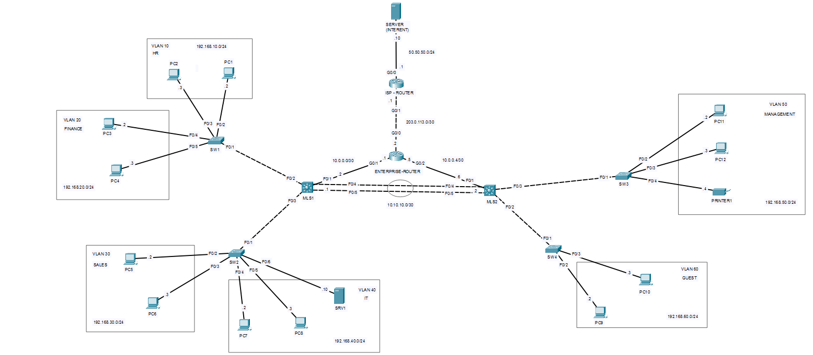

---

# 🎯 Project Objectives

- Design and implement a multilayer office network for ABC Technologies.
- Segment departments using VLANs 
- Configure trunk links between Access and Core switches for VLAN communication.
- Implement Layer 3 switching using SVIs for inter-VLAN routing.
- Configure LACP EtherChannel between Core switches 
- Deploy centralized DHCP services in enterprise router
- Configure static routing and default routing for Internet connectivity.
- Implement NAT/PAT to allow internal users to access the Internet.
- Apply ACL security policies to control communication between departments.
- Verify end-to-end connectivity

---

# 🛠️ Technologies Used

 - Cisco Packet Tracer
- VLANs
- IEEE 802.1Q Trunking
- Multilayer Switching
- Switch Virtual Interfaces (SVIs)
- EtherChannel (LACP)
- DHCP
- NAT
- ACL
- Static Default Route

---

# 🖥️ Network Architecture

### Enterprise Router

 - Connects the enterprise network to the ISP
 - Performs NAT
 - Provides Internet connectivity

### Core Layer

 - MLS1
 - MLS2

Responsibilities:

 - Inter-VLAN Routing
 - OSPF Routing
 - EtherChannel
 - DHCP Relay

### Access Layer

 - SW1
 - SW2
 - SW3
 - SW4

Responsibilities:

 - VLAN segmentation
 - End device connectivity
 - Trunk uplinks to Core

---

# 🏢 VLAN Configuration

The network contains six VLANs.

| VLAN    | Department |
|---------|------------|
| VLAN 10 | HR         |
| VLAN 20 | Finance    |
| VLAN 30 | Sales      |
| VLAN 40 | IT         |
| VLAN 50 | Management |
| VLAN 60 | Guest      |

---

## SW1 VLAN Configuration

```bash
vlan 10
 name HR
vlan 20
 name Finance

interface FastEthernet0/1
 switchport mode trunk

interface FastEthernet0/2
 switchport mode access
 switchport access vlan 10

interface FastEthernet0/3
 switchport mode access
 switchport access vlan 10

interface FastEthernet0/4
 switchport mode access
 switchport access vlan 20

interface FastEthernet0/5
 switchport mode access
 switchport access vlan 20
```

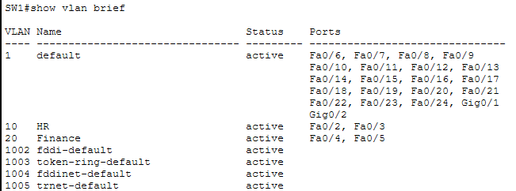

---

## SW2 VLAN Configuration

```bash
vlan 30
 name Sales
vlan 40
 name IT

interface FastEthernet0/1
 switchport mode trunk

interface FastEthernet0/2
 switchport mode access
 switchport access vlan 30

interface FastEthernet0/3
 switchport mode access
 switchport access vlan 30

interface FastEthernet0/4
 switchport mode access
 switchport access vlan 40

interface FastEthernet0/5
 switchport mode access
 switchport access vlan 40
```
 
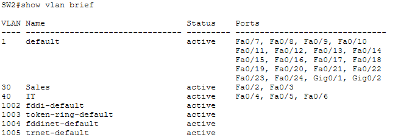

---

## SW3 VLAN Configuration

```bash
vlan 50
 name Management

interface FastEthernet0/1
 switchport mode trunk

interface FastEthernet0/2
 switchport mode access
 switchport access vlan 50

interface FastEthernet0/3
 switchport mode access
 switchport access vlan 50

interface FastEthernet0/4
 switchport mode access
 switchport access vlan 50
```

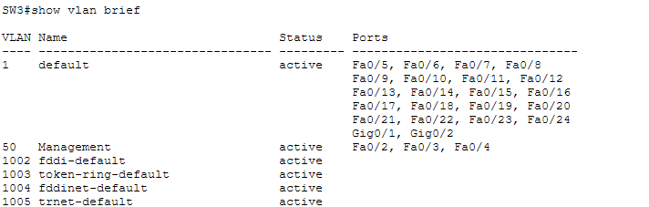

---

## SW4 VLAN Configuration

```bash
vlan 60
 name Guest

interface FastEthernet0/1
 switchport mode trunk

interface FastEthernet0/2
 switchport mode access
 switchport access vlan 60

interface FastEthernet0/3
 switchport mode access
 switchport access vlan 60
```

---

# 🔗 Trunk Configuration

Trunk links were configured between the Access Switches and Core Switches to allow multiple VLANs across a single physical connection.

## MLS1 Trunk Ports

```bash
ip routing

vlan 10
 name HR
vlan 20
 name Finance
vlan 30
 name Sales
vlan 40
 name IT

interface FastEthernet0/2
 switchport mode trunk

interface FastEthernet0/3
 switchport mode trunk
```

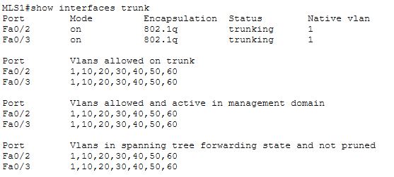

---

## MLS2 Trunk Ports

```bash
ip routing

vlan 50
 name Management
vlan 60
 name Guest

interface FastEthernet0/2
 switchport mode trunk

interface FastEthernet0/3
 switchport mode trunk
```

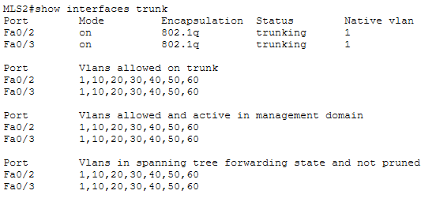

---

# ⚡ EtherChannel Configuration

LACP EtherChannel was configured between MLS1 and MLS2 to provide:

 MLS1

```bash
interface FastEthernet0/4
 channel-group 1 mode active

interface FastEthernet0/5
 channel-group 1 mode active

interface Port-channel1
 switchport mode trunk
```

 MLS2

```bash
 interface FastEthernet0/4
 channel-group 1 mode active

interface FastEthernet0/5
 channel-group 1 mode active

interface Port-channel1
 switchport mode trunk
 ```

Verification:

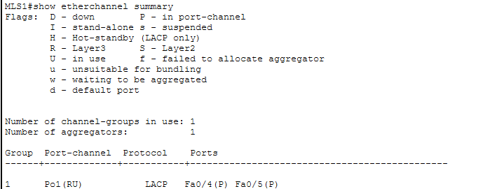

---

# 🌐 Inter-VLAN Routing (SVIs)

Inter-VLAN Routing is performed on the Multilayer Switches using Switch Virtual Interfaces (SVIs).

## MLS1 SVIs

```bash
interface FastEthernet0/1
 no switchport
 ip address 10.0.0.2 255.255.255.252
 no shutdown

interface Vlan10
 ip address 192.168.10.1 255.255.255.0
 ip helper-address 10.0.0.1
 no shutdown

interface Vlan20
 ip address 192.168.20.1 255.255.255.0
 ip helper-address 10.0.0.1
 no shutdown

interface Vlan30
 ip address 192.168.30.1 255.255.255.0
 ip helper-address 10.0.0.1
 no shutdown

interface Vlan40
 ip address 192.168.40.1 255.255.255.0
 ip helper-address 10.0.0.1
 no shutdown

ip route 0.0.0.0 0.0.0.0 10.0.0.1
```

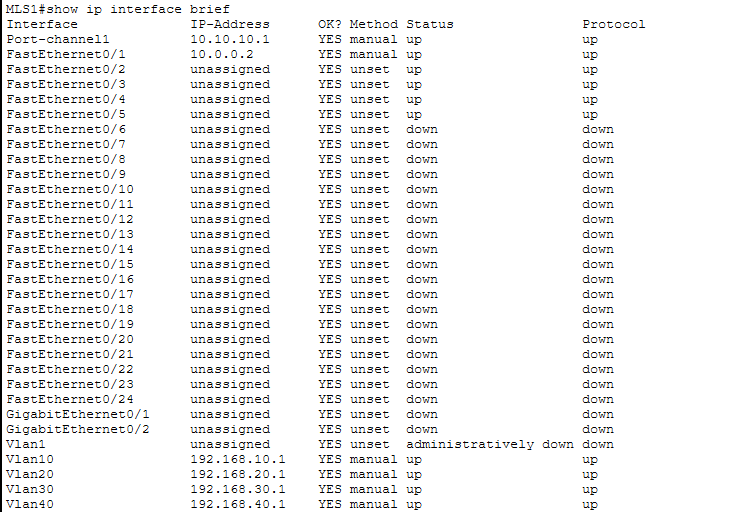

---

## MLS2 SVIs

```bash
interface FastEthernet0/1
 no switchport
 ip address 10.0.0.6 255.255.255.252
 no shutdown

interface Vlan50
 ip address 192.168.50.1 255.255.255.0
 ip helper-address 10.0.0.5
 no shutdown

interface Vlan60
 ip address 192.168.60.1 255.255.255.0
 ip helper-address 10.0.0.5
 no shutdown

ip route 0.0.0.0 0.0.0.0 10.0.0.5
```

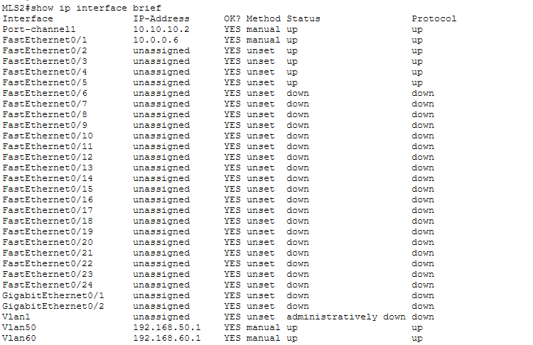

---

# 📡 DHCP Configuration

Centralized DHCP services were configured to dynamically assign IP addresses to all VLANs.

```bash
ip dhcp excluded-address 192.168.10.1
ip dhcp excluded-address 192.168.20.1
ip dhcp excluded-address 192.168.30.1
ip dhcp excluded-address 192.168.40.1
ip dhcp excluded-address 192.168.50.1
ip dhcp excluded-address 192.168.60.1
ip dhcp excluded-address 192.168.40.10

ip dhcp pool HR
 network 192.168.10.0 255.255.255.0
 default-router 192.168.10.1
 dns-server 192.168.40.10
ip dhcp pool Finance
 network 192.168.20.0 255.255.255.0
 default-router 192.168.20.1
 dns-server 192.168.40.10
ip dhcp pool Sales
 network 192.168.30.0 255.255.255.0
 default-router 192.168.30.1
 dns-server 192.168.40.10
ip dhcp pool IT
 network 192.168.40.0 255.255.255.0
 default-router 192.168.40.1
 dns-server 192.168.40.10
ip dhcp pool Management
 network 192.168.50.0 255.255.255.0
 default-router 192.168.50.1
 dns-server 192.168.40.10
ip dhcp pool Guest
 network 192.168.60.0 255.255.255.0
 default-router 192.168.60.1
 dns-server 192.168.40.10

interface GigabitEthernet0/0
 ip address 203.0.113.2 255.255.255.252
 ip nat outside
 duplex auto
 speed auto

interface GigabitEthernet0/1
 ip address 10.0.0.1 255.255.255.252
 ip nat inside
 duplex auto
 speed auto

interface GigabitEthernet0/2
 ip address 10.0.0.5 255.255.255.252
 ip nat inside
 duplex auto
 speed auto
```

Verification:

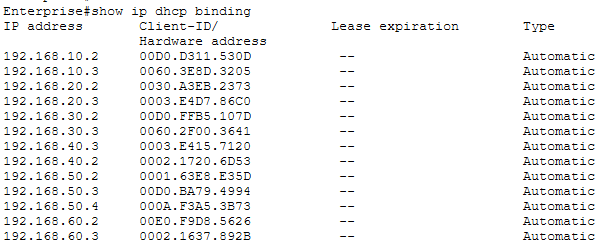

---

# 🛣️ Routing Table Verification

## Enterprise Router

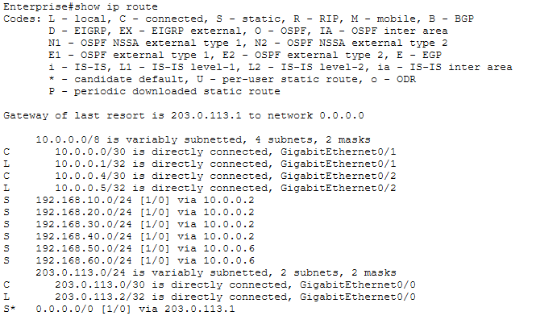

---

## MLS1 Routing Table

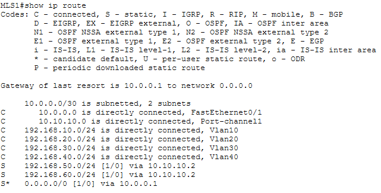

---

# 🌍 NAT Configuration

Network Address Translation (NAT) was configured on the Enterprise Router to allow internal private IP addresses to communicate with external networks.

---

# 🔐 Access Control Lists (ACL)

- Guest VLAN cannot access HR. 
- Guest VLAN cannot access Finance.
- Guest VLAN cannot access Management.

```bash
access-list 1 permit 192.168.10.0 0.0.0.255
access-list 1 permit 192.168.20.0 0.0.0.255
access-list 1 permit 192.168.30.0 0.0.0.255
access-list 1 permit 192.168.40.0 0.0.0.255
access-list 1 permit 192.168.50.0 0.0.0.255
access-list 1 permit 192.168.60.0 0.0.0.255

MLS2(config)# interface vlan 60
MLS2(config-if)# ip access-group 1 in
```
ACLs were configured to restrict traffic from the Guest VLAN while allowing authorized communication across the enterprise network.

---

# ✅ Connectivity Verification

## HR → Finance

Successful communication between HR and Finance VLAN.

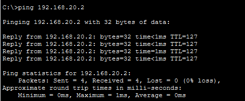

---

## Sales → IT

Successful communication between Sales and IT VLAN.

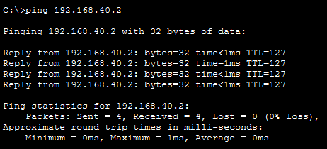

---

## HR → Management

Successful communication between HR and Management VLAN.

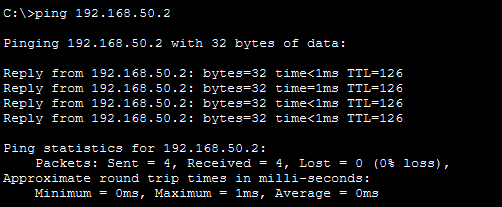

---


# 🎯 Skills Demonstrated

 - Enterprise Network Design
 - VLAN Implementation
 - IEEE 802.1Q Trunking
 - EtherChannel (LACP)
 - Inter-VLAN Routing
 - Switch Virtual Interfaces (SVIs)
 - OSPF Dynamic Routing
 - DHCP Configuration
 - NAT Configuration
 - ACL Configuration
 - Routing Verification
 - End-to-End Network Troubleshooting

---

# 📌 Conclusion

This project demonstrates the implementation of a scalable Enterprise Campus Network using Cisco networking technologies. It integrates Layer 2 and Layer 3 networking concepts including VLAN segmentation, Inter-VLAN Routing, EtherChannel, OSPF, DHCP, NAT, and ACLs to provide secure and efficient communication across the enterprise.

The successful verification of routing tables, VLAN communication, DHCP address allocation, and end-to-end connectivity confirms the correct operation of the network and highlights practical enterprise networking skills applicable to real-world environments.

# 👩‍💻 Author

Dhanalakshmi.B

Computer Science Engineer 

Aspiring Network Engineer

Currently studying CCNA, Linux, and Enterprise Networking.
